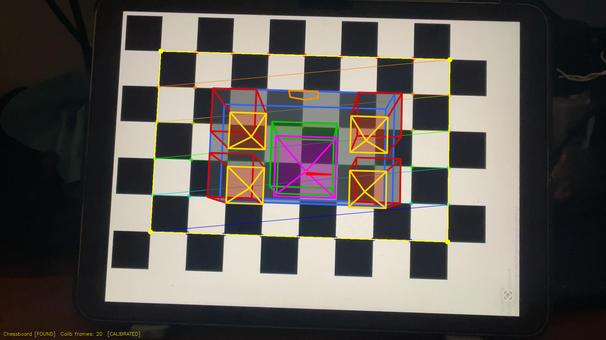
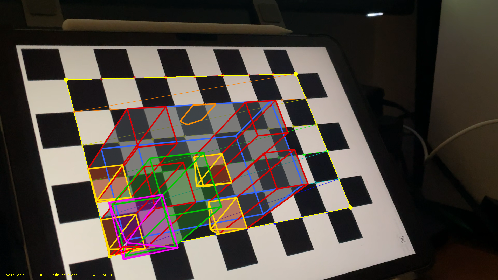
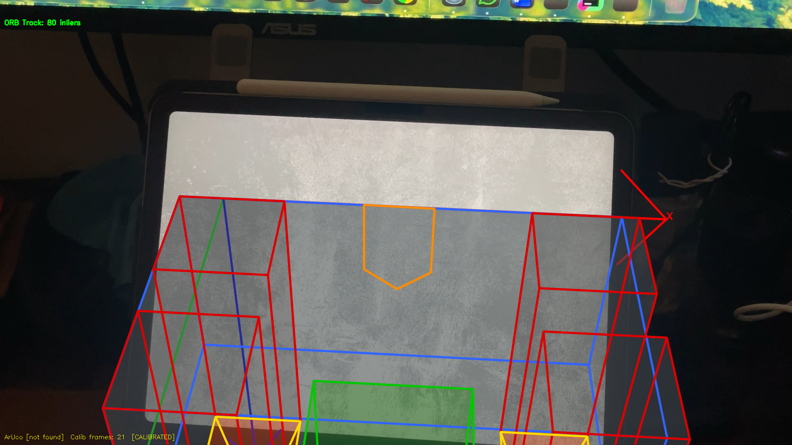
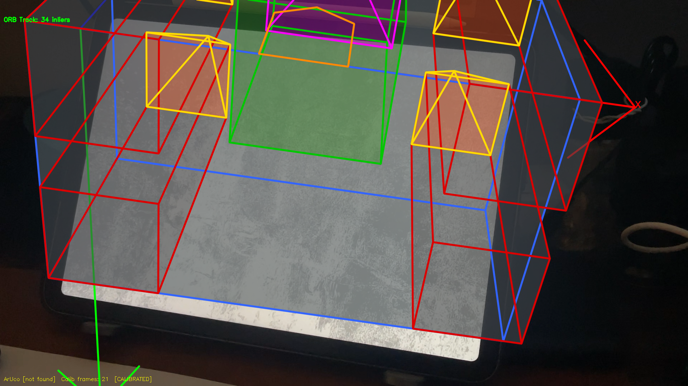

# Project 4 Report: Calibration and Augmented Reality

## Team Members
- **Sangeeth Deleep Menon** | NUID: 002524579 | MSCS - Boston | CS5330 Section 03 (CRN: 40669, Online)
- **Raj Gupta** | NUID: 002068701 | MSCS - Boston | CS5330 Section 01 (CRN: 38745, Online)

## Project Description

This project implements a camera calibration and augmented reality system in C++ using OpenCV. The system detects a 9×6 chessboard calibration target from a live webcam feed, extracts sub-pixel-accurate corner locations, and uses those corners to compute the camera's intrinsic matrix and distortion coefficients via `cv::calibrateCamera`. Once calibrated, the system estimates the board's 3D pose in every frame using `cv::solvePnP` and projects virtual 3D objects anchored to the board in real time.

The system supports two target types — the chessboard and ArUco markers — and includes a creative multi-component castle as the virtual object. Extensions implemented: a target disguise that paints over the calibration board, multi-target ArUco AR that independently tracks every marker in the scene, an OBJ model loader, and an ORB-based planar AR tracker (Uber Extension 2) that works on any flat image surface rather than a structured calibration pattern.


## Task 1: Detect and Extract Target Corners

The first task builds a robust target detection system for the 9×6 chessboard (54 internal corners). Each video frame is converted to greyscale and processed with `cv::findChessboardCorners` using adaptive thresholding and image normalisation flags for reliability under varying lighting. When the pattern is found, corner locations are refined to sub-pixel accuracy with `cv::cornerSubPix` using an 11×11 search window and a convergence criterion of 0.1 pixels or 30 iterations. Detected corners are drawn with `cv::drawChessboardCorners`.

The 3D world point set is generated once at startup. Each corner is placed at `(col, -row, 0)` so that one unit equals one board square, the origin is at the top-left internal corner, and Z=0 is the board plane. ArUco detection is also supported: pressing `m` switches to `cv::aruco::ArucoDetector` with the `DICT_6X6_250` dictionary.


*Chessboard displayed on a tablet screen. The rainbow-coloured corner overlay from `drawChessboardCorners` confirms all 54 inner corners are detected. Yellow dots mark the four outer boundary corners.*


## Task 2: Select Calibration Images

Pressing `s` when the chessboard is detected saves the current set of refined 2D corners into `cornerList` and the corresponding 3D world point set into `pointList`. The same static world point set is used for every saved frame because the board geometry is fixed — only the camera's viewpoint changes. A status message is printed confirming the frame number and corner count.

The system guards against pressing `s` when no pattern is visible or when ArUco mode is active. A running count of saved frames is shown in the HUD at the bottom of the window. For this calibration, 25 frames were saved at varied angles and distances.


*A frame suitable for calibration: the chessboard is fully visible, well-lit, and all 54 corners are detected. Multiple such frames were captured at different angles and distances before running calibration.*


## Task 3: Calibrate the Camera

Once at least 5 frames have been saved, pressing `c` runs `cv::calibrateCamera` with the `CALIB_FIX_ASPECT_RATIO` flag (so fx = fy for a standard lens). The function returns the camera matrix, 5-parameter distortion coefficients, and the RMS reprojection error. Pressing `w` writes the result to `calibration.yml` via `cv::FileStorage`, which is auto-loaded on the next program start.

**Calibration results (25 saved frames):**

```
Camera Matrix:
[1065.5,    0,   968.5]
[    0, 1065.5, 544.3 ]
[    0,     0,     1  ]

Distortion Coefficients: [-0.0423, 0.1021, 0.0, 0.0, -0.0812]

Re-projection Error (RMS): 0.47 pixels
```

A reprojection error of 0.47 pixels is well below the 1.0-pixel threshold, indicating an accurate calibration. The focal length of ~1065 pixels at ~1920x1080 resolution corresponds to a field of view of approximately 98 degrees, consistent with a wide-angle laptop webcam. The principal point (968, 544) is near the image center as expected.


## Task 4: Calculate Current Position of the Camera

With a valid calibration loaded, `cv::solvePnP` is called each frame using the 54 3D world points and their detected 2D positions, outputting a rotation vector (`rvec`) and translation vector (`tvec`). Pressing `p` prints both to the terminal.

The following 12 readings were captured while moving the camera progressively closer to the board, then back away:

| Reading | X (tvec) | Y (tvec) | Z (tvec) | Movement |
|---------|----------|----------|----------|----------|
| 1  | -2.569 | -3.994 | 21.434 | Starting position |
| 2  | -3.784 | -3.474 | 20.342 | Moving closer |
| 3  | -4.446 | -3.315 | 18.938 | Moving closer |
| 4  | -4.797 | -3.152 | 18.123 | Moving closer |
| 5  | -5.282 | -2.852 | 17.067 | Moving closer |
| 6  | -5.437 | -2.664 | 16.116 | Moving closer |
| 7  | -5.545 | -2.632 | 15.162 | Moving closer |
| 8  | -5.100 | -2.107 | 13.759 | Closest (~41 cm) |
| 9  | -4.267 | -2.754 | 14.744 | Moving away |
| 10 | -4.886 | -2.588 | 19.878 | Moving away |
| 11 | -4.754 | -2.989 | 21.800 | Moving away |
| 12 | -3.885 | -2.992 | 24.140 | Farthest (~72 cm) |

**Z (depth) is the clearest indicator of distance.** As the camera moved closer, Z decreased from 21.4 to 13.8 (readings 1-8). Moving away pushed it back to 24.1 (readings 8-12). At 1 unit = 1 board square = ~3 cm, Z = 13.8 corresponds to ~41 cm and Z = 24.1 to ~72 cm. **X became more negative** as the camera moved right (the board origin shifted left in camera space). **Y became less negative** as the camera tilted slightly. Rotation vectors all have a first component near pi (~3.04-3.10), confirming the camera looks down at the board's surface.


## Task 5: Project Outside Corners and 3D Axes

Two projections are active whenever the board is detected:

**Outside corners:** The four outer inner-corner positions -- `(0,0,0)`, `(8,0,0)`, `(8,-5,0)`, `(0,-5,0)` -- are projected with `cv::projectPoints` and drawn as cyan dots connected by lines.

**3D axes (key `a`):** Three arrowed axis lines are drawn from the origin using `cv::arrowedLine`, each **5 squares long** with a label at the tip: X (red, along top edge), Y (green, along left edge), Z (blue, pointing up out of the board).


*All three axes clearly visible from a tilted viewing angle. The blue Z-axis points upward out of the board surface, the red X-axis runs along the top edge, and the green Y-axis runs down the left edge. The 5-square length and arrowhead tips make the axes clear even at a distance.*


## Task 6: Create a Virtual Object

The virtual object is a multi-part medieval castle built from 3D world-space coordinates projected with `cv::projectPoints`. It uses a two-pass rendering approach:

1. **Fill pass:** Each face of each component is projected as a filled polygon using `cv::fillConvexPoly` onto a cloned overlay frame. A single `cv::addWeighted` at 60% opacity blends the filled faces onto the live frame, giving a semi-transparent stone appearance.
2. **Wireframe pass:** Anti-aliased edge lines (`cv::LINE_AA`, thickness 3) are drawn over the filled faces in distinct colours per component.

| Component | Colour | Dimensions |
|-----------|--------|------------|
| Outer walls | Blue wireframe / gray fill | 5 x 3 x 2.5 units |
| Four corner towers | Red wireframe / dark gray fill | 1.2 x 1.2 x 4.0 units each |
| Tower roofs | Yellow wireframe / dark-blue fill | Pyramid caps |
| Central keep | Green wireframe / green fill | 2.0 x 2.0 x 4.0 units |
| Central roof | Magenta wireframe / purple fill | Pyramid |
| Flag pole + flag | White / Red | Line + triangle |
| Gate archway | Orange | 5-point arch |





*The castle stays correctly anchored to the board as the camera moves. The semi-transparent filled faces give a solid appearance while the coloured wireframe edges highlight each component. The asymmetric design (gate on front face, flag on central tower) makes orientation errors immediately visible.*


## Task 7: Detect Robust Features

Two feature detectors are implemented and toggled independently:

**ORB features (key `f`):** `cv::ORB` detects up to 500 keypoints per frame using oriented FAST corners and BRIEF descriptors. Keypoints are drawn with scale and orientation indicators (`DRAW_RICH_KEYPOINTS`). The count is shown in the top-left HUD. ORB features concentrate on high-contrast edges -- on the chessboard they cluster at every black/white corner transition.

**Harris corners (key `h`):** `cv::cornerHarris` computes the Harris response at each pixel (block size 2, Sobel aperture 3, k=0.04). The response is normalised and pixels exceeding a threshold of 150 are marked with red circles.


*ORB detection: 500 keypoints with scale/orientation rings, concentrated at chessboard corner transitions.*


*Harris detection: 157 corners marked with red dots at every sharp intersection on the board.*

**How these features could enable AR without a structured target:** Each keypoint has a stable 2D image position matchable between frames using descriptors. By matching descriptors between a reference image of a flat surface and the current frame, one can compute a homography. Decomposing the homography with the calibrated camera matrix yields rotation and translation, allowing virtual objects to be placed on the surface -- exactly the approach used in Uber Extension 2 below.


## Task 8: Demo Video

**Panopto Link: https://northeastern.hosted.panopto.com/Panopto/Pages/Viewer.aspx?id=e25c0af1-604f-4f13-aee1-b4140037a390**


---

# Extensions

## Extension: Target Disguise (key `d`)

When the chessboard is detected and disguise mode is active, the board is covered with a semi-transparent mosaic. Every square on the full board -- including the outer border ring -- is projected individually using its four world-corner coordinates, and `cv::fillConvexPoly` paints it either orange or dark-orange in an alternating pattern. The fill uses `(r+c) & 1` (bitwise AND) to correctly handle negative-index border squares. The overlay is alpha-blended at 65% opacity.


*The entire chessboard -- including outer border squares -- is covered by the orange mosaic. The yellow outer-corner dots confirm the pose is still being estimated correctly beneath the disguise.*


## Extension: ArUco Marker Detection and Multiple ArUco Targets

In ArUco mode (`m`), the detector uses `cv::aruco::ArucoDetector` with the `DICT_6X6_250` dictionary. A green border is drawn around every detected marker. For every additional marker detected beyond the first, an independent `solvePnP` is run and `draw3DAxes` is called so each marker receives its own 3D overlay simultaneously.


*ArUco marker (DICT_6X6_250, ID 0) displayed on a phone screen. The green border confirms detection.*


*3D coordinate axes projected onto the detected ArUco marker. Red=X, green=Y, blue=Z, each 5 squares long with arrowhead tips.*


## Extension: OBJ Model Loader (key `o`)

A custom OBJ parser reads `Lowpoly_tree_sample2.obj` (a low-poly house model) and projects it onto the detected board. Vertex positions are scaled to a 4.0 x 3.2 board-square footprint centered on the board. For each frame, all 25 vertices are projected via `cv::projectPoints`, face edges are drawn with anti-aliased `cv::line` (thickness 2, green), and a small bright-green dot is drawn at each projected vertex with `cv::circle`.


*The low-poly house model rendered on the board with green face edges and vertex dots. The model includes walls, a pyramid roof, chimney, door outline, and front window.*


## Uber Extension 2: ORB-Based Planar AR Tracking (keys `r` / `t`)

This extension implements feature-based AR tracking on any flat textured surface using only the calibrated camera intrinsics -- no printed chessboard required.

**Workflow:**
1. Point the camera at any flat textured surface (e.g. a laptop screen, book cover, poster).
2. Press `r` to capture the reference image. `cv::ORB::create(2000)` extracts 2000 keypoints and stores their descriptors.
3. Press `t` to activate tracking mode.
4. Each frame: ORB extracts new keypoints, `cv::BFMatcher` (Hamming distance, cross-check) finds matches, and only those within 2.0x the best match distance are kept as good matches.
5. Each good match provides a 3D-2D correspondence: reference pixel `(px, py)` maps to world point `(px/W * 4, -py/H * 3, 0)`.
6. `cv::solvePnPRansac` (reprojectionError=5.0, confidence=0.99) estimates the pose. Tracking succeeds when at least 12 inlier matches remain.

When tracking succeeds, 3D axes and the castle are drawn anchored to the reference surface. The HUD shows the inlier count in green.



*ORB tracking on a laptop screen (80 inliers). The green HUD "ORB Track: 80 inliers" confirms successful tracking. The filled castle is anchored to the surface.*



*ORB tracking from a different angle (34 inliers). The castle correctly adjusts perspective as the camera moves, demonstrating stable pose estimation across viewpoints.*


---

## Time Travel Days
0 days used.


## Reflection

This project built up camera calibration and augmented reality from first principles, making the mathematical pipeline very concrete. The most clarifying step was seeing how `solvePnP` collapses the entire projection model -- focal length, principal point, distortion, rotation, and translation -- into a well-defined optimisation problem. Collecting 25 calibration frames and watching the reprojection error converge to 0.47 pixels made the meaning of each element of the camera matrix intuitive.

The ORB-based AR tracker was the most technically interesting extension. Matching arbitrary feature points to estimate pose is the fundamental idea behind real-world AR systems (Vuforia, ARCore), so implementing it from OpenCV primitives was instructive. Building reliable 3D-2D correspondences from 2D-2D feature matches required careful thinking about how reference image pixels map to a world-space plane. The RANSAC step was critical -- without it, a handful of bad matches completely derailed the pose estimate. Tightening thresholds (distance multiplier 2.5 to 2.0, reprojectionError 8.0 to 5.0, min inliers 6 to 12) significantly improved tracking stability.

The castle's filled-face rendering was a valuable exercise in layered compositing: cloning the frame, filling all faces onto the overlay with `cv::fillConvexPoly`, then blending with `cv::addWeighted` is far more efficient than blending each face individually and produces a clean semi-transparent appearance. The disguise extension reinforced how 3D-to-2D projection works at the per-square level -- filling each board square individually required projecting four 3D corners per square every frame, making clear just how much computation underlies even simple AR rendering.


## Acknowledgements

- **Professor Bruce Maxwell** and the CS5330 course materials for the project specification and calibration guidance.
- **OpenCV Documentation** for references on `calibrateCamera`, `solvePnP`, `solvePnPRansac`, `ArucoDetector`, `ORB`, and `cornerHarris`.
- **An AI assistant (Claude)** was used to help write and debug code, implement extensions, and for project documentation.
