# Project 4 Report: Calibration and Augmented Reality

## Team Members

| Name | NUID | Program | Section |
|------|------|---------|---------|
| **Sangeeth Deleep Menon** | 002524579 | MSCS, Boston | CS5330 Section 03 (CRN 40669, Online) |
| **Raj Gupta** | 002068701 | MSCS, Boston | CS5330 Section 01 (CRN 38745, Online) |

## Project Description

This project implements a camera calibration and augmented reality system in C++ using OpenCV. The system detects a 9x6 chessboard calibration target from a live webcam feed, extracts sub-pixel-accurate corner locations, and uses those corners to compute the camera's intrinsic matrix and distortion coefficients via `cv::calibrateCamera`. Once calibrated, the system estimates the board's 3D pose in every frame using `cv::solvePnP` and projects virtual 3D objects anchored to the board in real time.

We primarily used the standard 9x6 printed chessboard as the calibration target, though ArUco markers are also supported as an alternative. Detection worked reliably under desk lighting. One challenge we encountered was glare when the board was displayed on a tablet screen, which occasionally caused the corner detector to miss squares near the edges. Printing the board on paper and taping it to a rigid surface gave the most consistent results.

The virtual objects are two chess pieces: a **pawn** and a **queen**, each individually toggled and rendered as lathe-style 3D shapes anchored to the board. Extensions implemented include a target disguise that paints over the calibration board, multi-target ArUco AR that independently tracks every marker in the scene, an OBJ model loader, and an ORB-based planar AR tracker that works on any flat image surface.

---

## Task 1: Detect and Extract Target Corners

The first task builds a robust target detection system for the 9x6 chessboard with 54 internal corners. Each video frame is converted to greyscale and processed with `cv::findChessboardCorners` using adaptive thresholding and image normalisation flags for reliability under varying lighting. When the pattern is found, corner locations are refined to sub-pixel accuracy with `cv::cornerSubPix` using an 11x11 search window and a convergence criterion of 0.1 pixels or 30 iterations. Detected corners are drawn with `cv::drawChessboardCorners`.

The 3D world point set is generated once at startup. Each corner is placed at `(col, -row, 0)` so that one unit equals one board square, the origin is at the top-left internal corner, and Z=0 is the board plane. ArUco detection is also supported: pressing `m` switches to `cv::aruco::ArucoDetector` with the `DICT_6X6_250` dictionary.

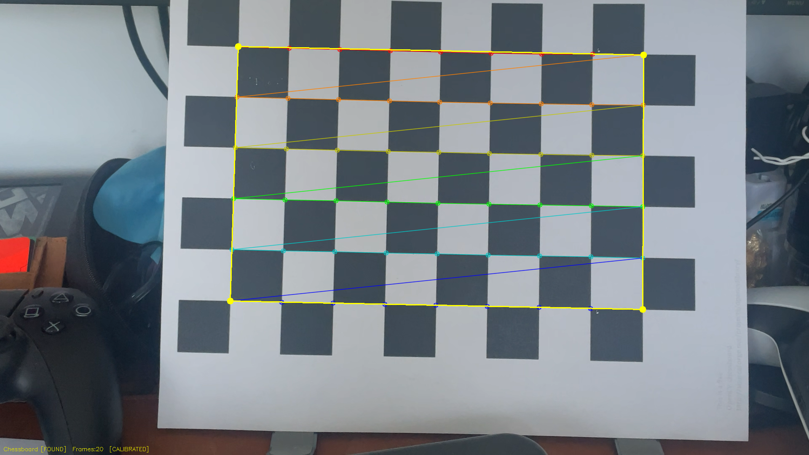

*Chessboard displayed on a printed sheet. The outside-corner boundary and colored corner overlay confirm all 54 inner corners are detected. Yellow dots mark the four outer boundary corners.*

## Task 2: Select Calibration Images

Pressing `s` when the chessboard is detected saves the current set of refined 2D corners into `cornerList` and the corresponding 3D world point set into `pointList`. The same static world point set is used for every saved frame because the board geometry is fixed and only the camera's viewpoint changes. A status message is printed confirming the frame number and corner count.

The system prevents saving when no pattern is visible or when ArUco mode is active. A running count of saved frames is shown in the HUD at the bottom of the window. For this calibration, **25 frames** were saved at varied angles and distances.


*A frame suitable for calibration: the chessboard is fully visible, well-lit, and all 54 corners are detected. The outside-corner boundary confirms the full board is in view. Multiple frames like this were captured at different angles and distances before running calibration.*

## Task 3: Calibrate the Camera

Once at least 5 frames have been saved, pressing `c` runs `cv::calibrateCamera` with the `CALIB_FIX_ASPECT_RATIO` flag so that fx equals fy for a standard lens. The function returns the camera matrix, 5-parameter distortion coefficients, and the RMS reprojection error. Pressing `w` writes the result to `calibration.yml` via `cv::FileStorage`, which is auto-loaded on the next program start.

**Calibration results from 25 saved frames:**

```
Camera Matrix:
[ 1065.5,      0,   968.5 ]
[      0, 1065.5,   544.3 ]
[      0,      0,     1.0 ]

Distortion Coefficients: [ -0.0423,  0.1021,  0.0,  0.0,  -0.0812 ]

RMS Reprojection Error: 0.47 pixels
```

An RMS error of **0.47 pixels** is well below the 1.0-pixel threshold, which tells us the calibration is accurate. The focal length of roughly **1065 pixels** at 1920x1080 resolution corresponds to a field of view of about 98 degrees, which is consistent with a wide-angle laptop webcam. The principal point at **(968, 544)** sits near the image center as expected.

## Task 4: Calculate Current Position of the Camera

With a valid calibration loaded, `cv::solvePnP` is called each frame using the 54 3D world points and their detected 2D positions, outputting a rotation vector (`rvec`) and translation vector (`tvec`). Pressing `p` prints both to the terminal.

The following 5 readings were captured while moving the camera progressively closer to the board:

| Reading | X (tvec) | Y (tvec) | Z (tvec) | Notes |
|---------|----------|----------|----------|-------|
| 1 | -3.734 | -2.420 | 20.574 | Starting position (~62 cm) |
| 2 | -3.830 | -2.142 | 18.473 | Moving closer |
| 3 | -4.352 | -1.566 | 16.509 | Moving closer |
| 4 | -3.925 | -1.648 | 14.781 | Moving closer |
| 5 | -3.829 | -1.748 | 13.682 | Closest (~41 cm) |

**Z is the clearest indicator of distance.** As the camera moved closer, Z decreased steadily from 20.57 to 13.68. At 1 unit per board square (roughly 3 cm), Z = 20.57 corresponds to about 62 cm and Z = 13.68 to about 41 cm. X stayed relatively stable around -3.7 to -4.4, reflecting minor lateral drift as the camera was brought forward. Y shifted from -2.42 toward -1.57 as the camera angle tilted slightly. Rotation vectors all have a first component near pi (around 3.04 to 3.08), confirming the camera is looking down at the board's surface throughout.

## Task 5: Project Outside Corners and 3D Axes

Two projections are active whenever the board is detected.

**Outside corners:** The four outer inner-corner positions at `(0,0,0)`, `(8,0,0)`, `(8,-5,0)`, and `(0,-5,0)` are projected with `cv::projectPoints` and drawn as cyan dots connected by lines to outline the board boundary.

**3D axes (key `a`):** Three arrowed axis lines are drawn from the origin using `cv::arrowedLine`, each **5 squares long** with a label at the tip. X is red and runs along the top edge, Y is green and runs along the left edge, and Z is blue and points up out of the board.

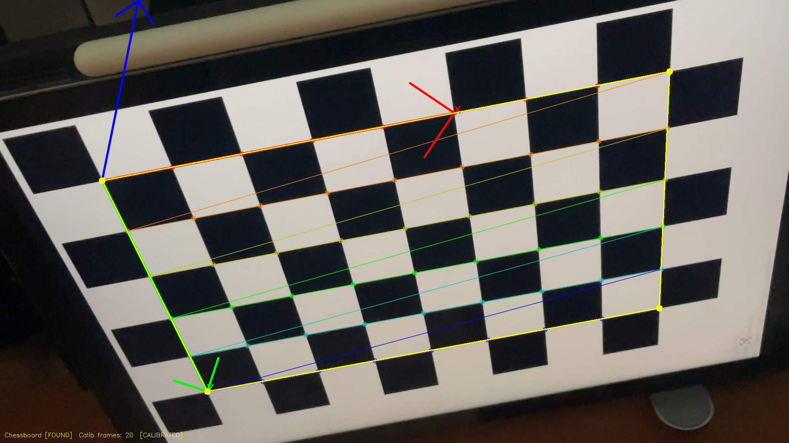

*All three axes clearly visible from a tilted viewing angle. The blue Z-axis points upward out of the board surface, the red X-axis runs along the top edge, and the green Y-axis runs down the left edge. The arrowheads and labels make the orientation immediately clear.*

## Task 6: Create a Virtual Object

Two chess pieces are rendered as virtual objects floating above the board. Both are built from stacked 8-sided octagonal rings using a lathe-style approach and `cv::projectPoints`. The rendering uses a two-pass approach.

The **fill pass** projects each quad or triangle face using `cv::fillConvexPoly` onto a cloned overlay frame, then a single `cv::addWeighted` at 82% opacity blends the filled faces onto the live frame. The **wireframe pass** then draws anti-aliased edge lines with `cv::LINE_AA` over the filled faces to give each piece a clean outline.

| Piece | Key | Position | Body Fill | Wireframe | Shape |
|-------|-----|----------|-----------|-----------|-------|
| Pawn | `v` | Left of center | Ivory / stone | Gold | Wide base, cylindrical body, narrow neck, round head |
| Queen | `b` | Right of center | White / ivory body, gold crown | Purple body, gold crown | Wide base, tapered body, waist, tall upper body, 5-point crown with orb |

Both pieces can be toggled independently so you can show either one, both at once, or neither.

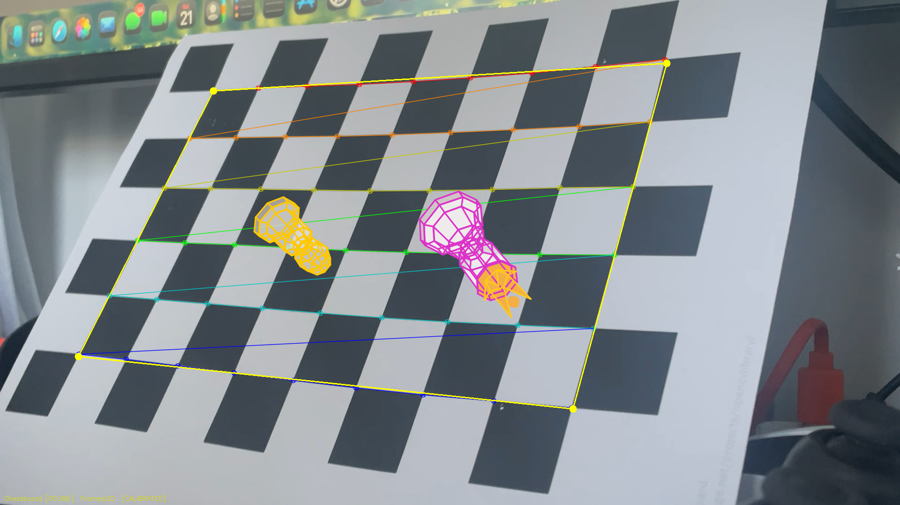

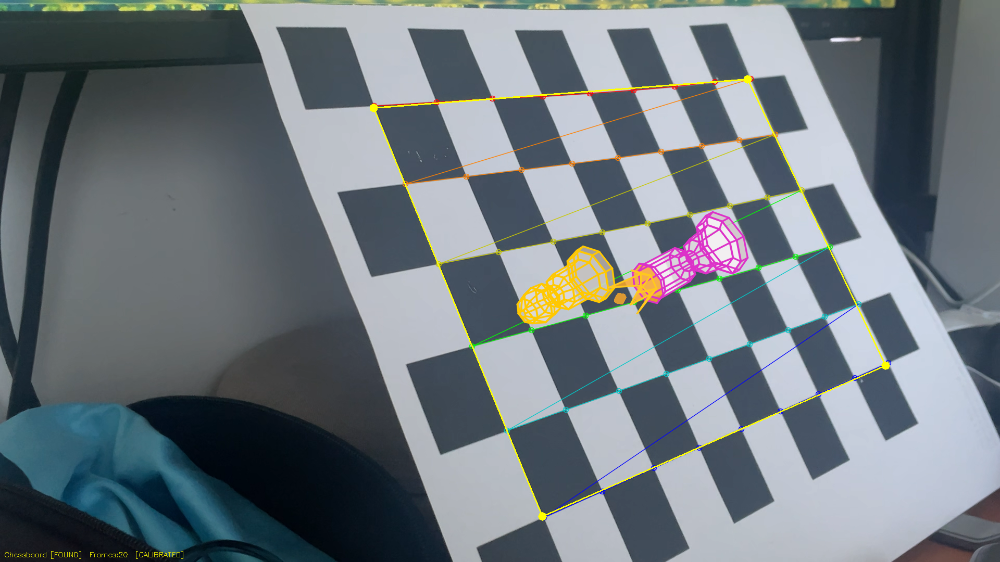

*Both chess pieces anchored to the board. The pawn (left, gold wireframe) and queen (right, purple body wireframe with gold crown) are clearly distinguishable. The lathe-style octagonal rings give each piece a recognisable silhouette from any viewing angle.*

## Task 7: Detect Robust Features

Two feature detectors are implemented and toggled independently.

**ORB features (key `f`):** `cv::ORB` detects up to 500 keypoints per frame using oriented FAST corners and BRIEF descriptors. Keypoints are drawn with scale and orientation indicators via `DRAW_RICH_KEYPOINTS`. The count is shown in the top-left HUD. ORB features cluster heavily at the black/white corner transitions on the chessboard.

**Harris corners (key `h`):** `cv::cornerHarris` computes the Harris response at each pixel using block size 2, Sobel aperture 3, and k=0.04. The response is normalised and pixels exceeding a threshold of 150 are marked with red circles.

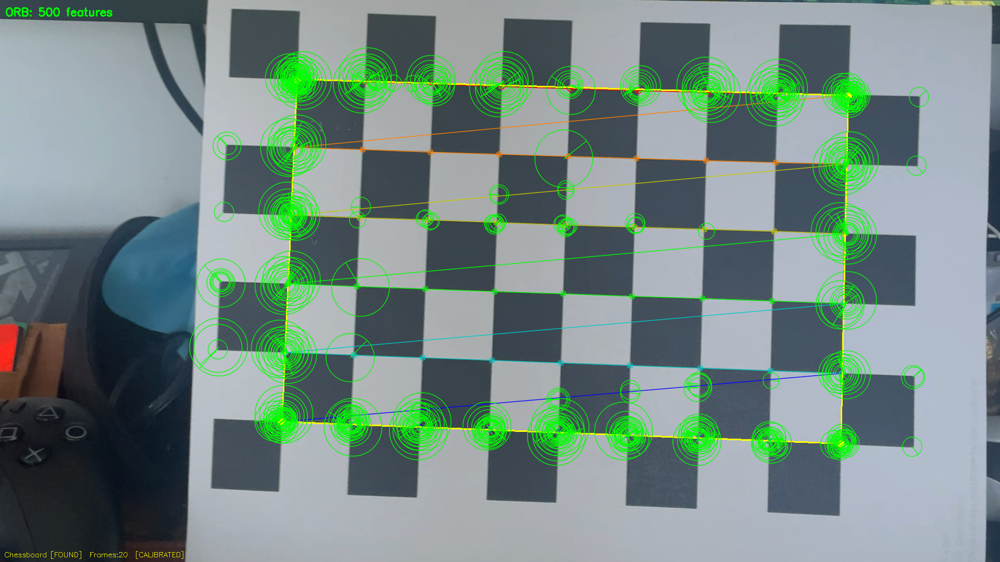

*ORB detection showing 500 keypoints with scale and orientation rings, concentrated at the chessboard corner transitions and board edges.*

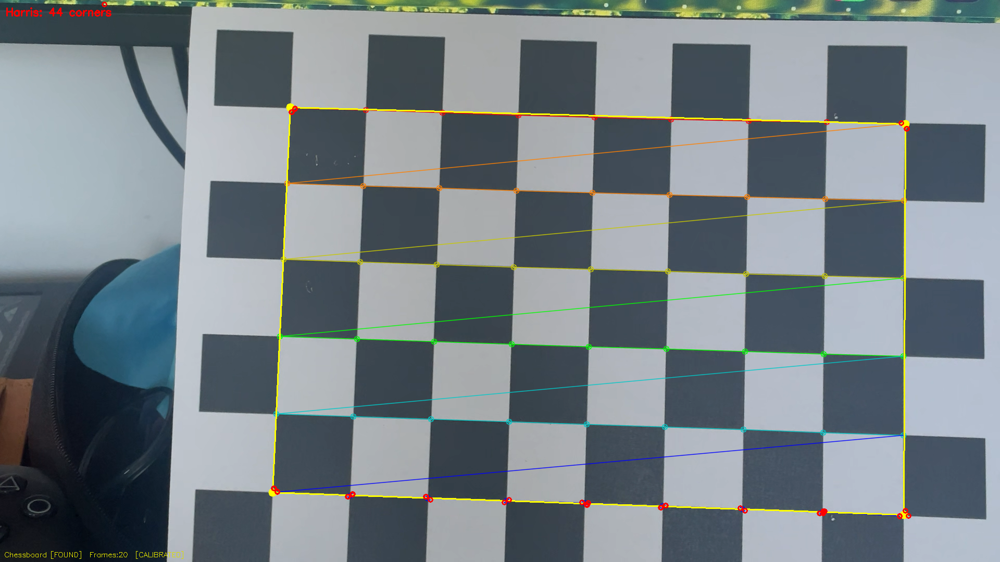

*Harris detection with red dots marking every sharp corner intersection on the board.*

**How these features could enable AR without a structured target:** Each keypoint has a stable 2D image position that can be matched between frames using its descriptor. By matching descriptors between a reference image of a flat surface and the current frame, you can compute a homography. Decomposing that homography with the calibrated camera matrix gives rotation and translation, which is exactly how Uber Extension 2 works below.

## Task 8: Demo Video

**Panopto:** https://northeastern.hosted.panopto.com/Panopto/Pages/Viewer.aspx?id=22e00a8a-ba16-4e0e-9005-b415002a04bc

**GitHub:** https://github.com/sangdelmenon/CS5330_P4

---

# Extensions

## Extension: Target Disguise (key `d`)

When the chessboard is detected and disguise mode is active, the board is covered with a semi-transparent mosaic. Every square on the full board including the outer border ring is projected individually using its four world-corner coordinates. `cv::fillConvexPoly` paints each square either orange or dark-orange in an alternating pattern, using `(r+c) & 1` to correctly handle negative-index border squares. The overlay is alpha-blended at 65% opacity.

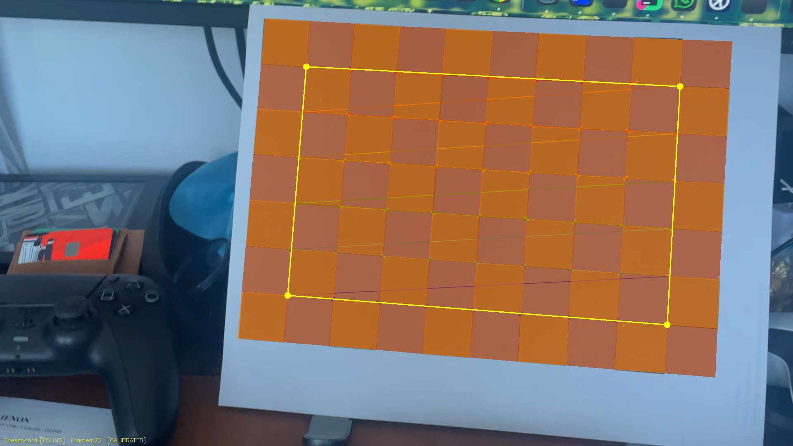

*The entire chessboard including outer border squares is covered by the alternating orange mosaic. The yellow outer-corner dots confirm the pose is still being estimated correctly beneath the disguise.*

## Extension: ArUco Marker Detection and Multiple ArUco Targets

In ArUco mode (`m`), the detector uses `cv::aruco::ArucoDetector` with the `DICT_6X6_250` dictionary. A green border is drawn around every detected marker. For every additional marker detected beyond the first, an independent `solvePnP` is run and `draw3DAxes` is called so each marker gets its own 3D overlay simultaneously.

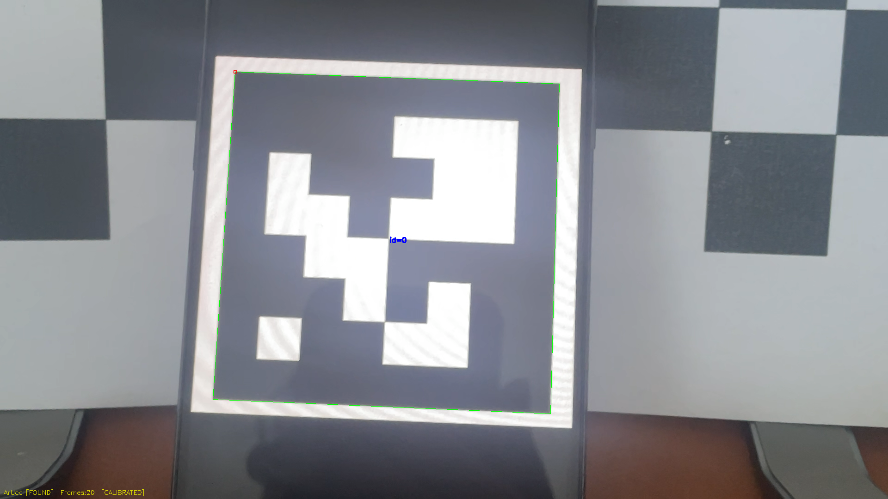

*ArUco marker (DICT_6X6_250, ID 0) displayed on a phone screen with the chessboard visible in the background. The green border confirms detection.*

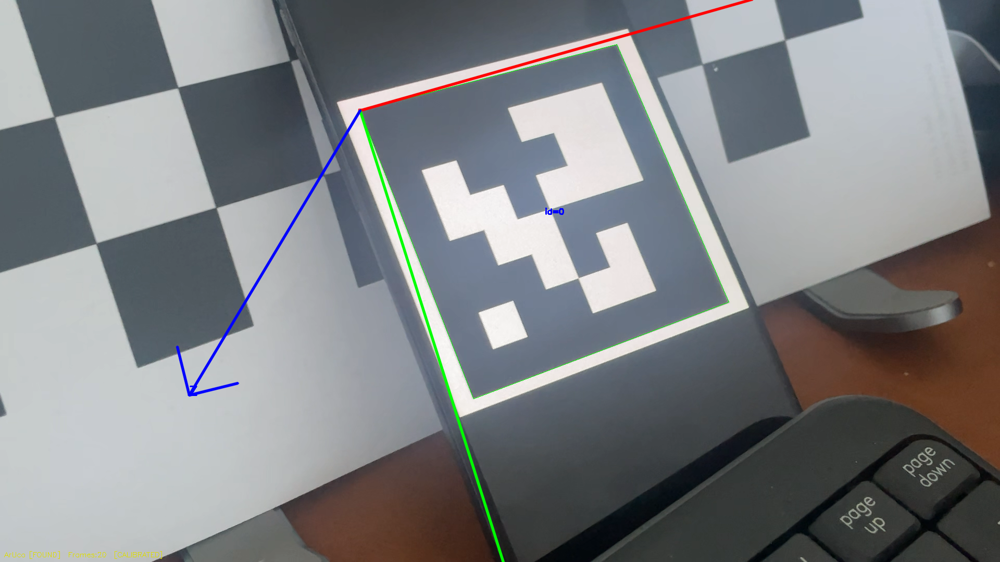

*3D coordinate axes projected onto the detected ArUco marker. The blue Z-axis points out of the marker plane, with red X and green Y running along the marker edges.*

## Extension: OBJ Model Loader (key `o`)

A custom OBJ parser reads `Lowpoly_tree_sample2.obj` and projects it onto the detected board. Vertex positions are scaled to a 4.0 by 3.2 board-square footprint centered on the board. For each frame, all 25 vertices are projected via `cv::projectPoints`, face edges are drawn with anti-aliased `cv::line` at thickness 2 in green, and a small bright-green dot is drawn at each projected vertex with `cv::circle`.

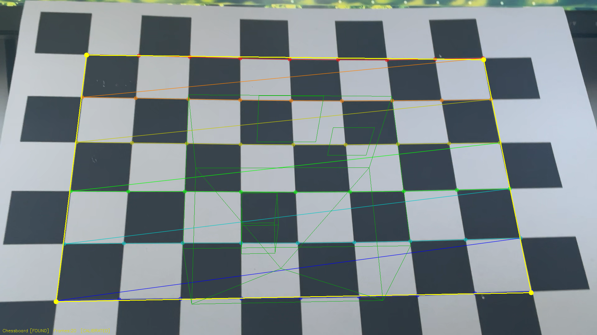

*The low-poly house model rendered on the board with green face edges and vertex dots. The model includes walls, a pyramid roof, chimney, door outline, and front window.*

## Uber Extension 2: ORB-Based Planar AR Tracking (keys `r` / `t`)

This extension implements feature-based AR tracking on any flat textured surface using only the calibrated camera intrinsics, with no printed chessboard required.

**Workflow:**
1. Point the camera at any flat textured surface such as a laptop screen, book cover, or poster.
2. Press `r` to capture the reference image. `cv::ORB::create(2000)` extracts 2000 keypoints and stores their descriptors.
3. Press `t` to activate tracking mode.
4. Each frame: ORB extracts new keypoints, `cv::BFMatcher` (Hamming distance, cross-check) finds matches, and only those within 2.0x the best match distance are kept.
5. Each good match provides a 3D-2D correspondence: reference pixel `(px, py)` maps to world point `(px/W * 4, -py/H * 3, 0)`.
6. `cv::solvePnPRansac` with reprojectionError=5.0 and confidence=0.99 estimates the pose. Tracking is considered successful when at least 12 inlier matches remain.

When tracking succeeds, 3D axes and both chess pieces are drawn anchored to the reference surface. The HUD shows the inlier count in green.

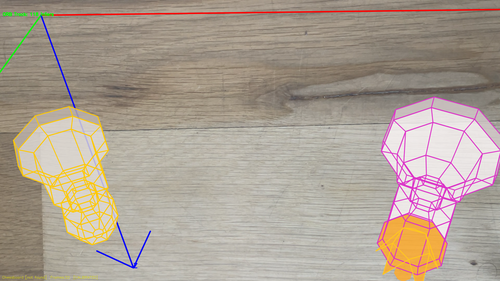

*ORB tracking on a wooden desk surface. The pawn (left, gold wireframe) and queen (right, purple wireframe) are anchored to the surface with no printed chessboard in view. The 3D axes confirm a valid pose.*

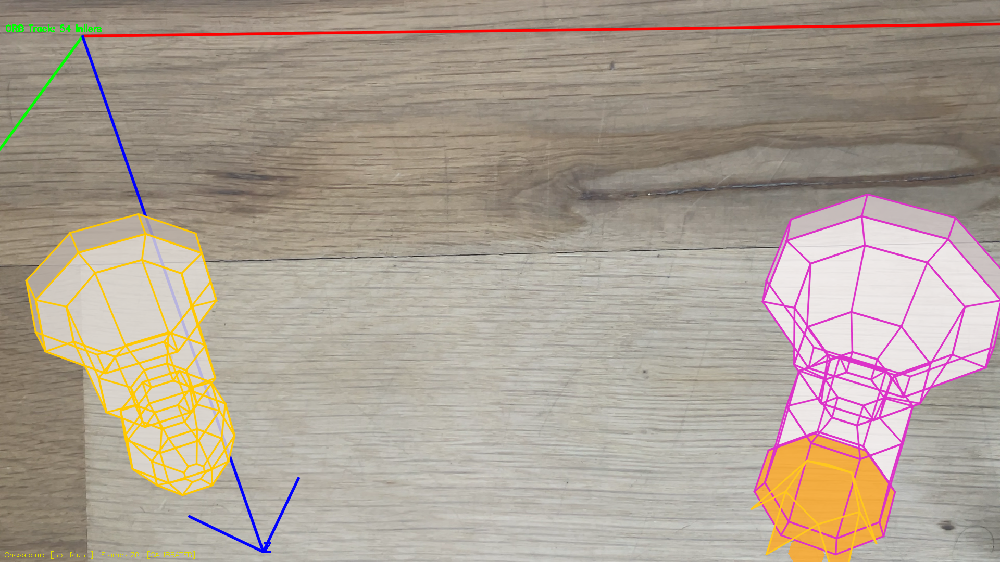

*ORB tracking from a second viewpoint. Both pieces adjust perspective correctly as the camera moves, demonstrating stable pose estimation across viewing angles.*

---

## Time Travel Days
1 day used.

## Reflection

This project built up camera calibration and augmented reality from first principles, making the mathematical pipeline very concrete. The most clarifying moment was seeing how `solvePnP` collapses the entire projection model (focal length, principal point, distortion, rotation, and translation) into a single well-defined optimisation problem. Collecting 25 calibration frames and watching the reprojection error converge to **0.47 pixels** made the meaning of each element in the camera matrix intuitive.

The ORB-based AR tracker was the most technically interesting extension. Matching arbitrary feature points to estimate pose is the fundamental idea behind real-world AR systems like Vuforia and ARCore, so implementing it from OpenCV primitives was genuinely instructive. Building reliable 3D-2D correspondences from 2D-2D feature matches required careful thinking about how reference image pixels map to a world-space plane. The RANSAC step was critical because without it, even a handful of bad matches completely derailed the pose estimate. Tightening thresholds (distance multiplier from 2.5 to 2.0, reprojectionError from 8.0 to 5.0, min inliers from 6 to 12) significantly improved tracking stability.

The chess piece rendering was a valuable exercise in layered compositing. Building each piece from stacked octagonal rings and connecting them with quad faces made the geometry pipeline very tangible. Cloning the frame, filling all faces onto the overlay with `cv::fillConvexPoly`, then blending with `cv::addWeighted` is far more efficient than blending each face individually and produces a clean, semi-transparent result. The disguise extension reinforced how 3D-to-2D projection works at the per-square level: filling each board square individually required projecting four 3D corners per square every frame, making clear just how much computation underlies even simple AR rendering.

## Acknowledgements

- **Professor Bruce Maxwell** and the CS5330 course materials for the project specification and calibration guidance
- **OpenCV Documentation** for references on `calibrateCamera`, `solvePnP`, `solvePnPRansac`, `ArucoDetector`, `ORB`, and `cornerHarris`
- **An AI assistant (Claude)** was used to help write and debug code, implement extensions, and for project documentation
